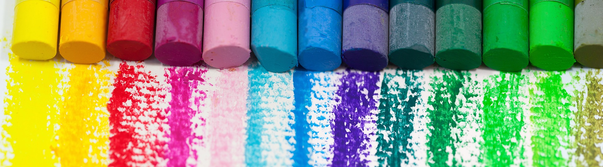

	
	<h1>🎨 newtykins/coli</h1>
	<blockquote>
		<h3>Powerful colour generation in the command line!</h3>
	</blockquote>

### What is coli?

coli is a CLI that I made as my first Rust project which allows you to generate random colours, create gradients between colours, and view trending colour palettes (found on [coolors.co](https://coolors.co)). I think it is kind of neat ¯\\\_(ツ)\_/¯

### Documentation

#### `coli random`

generates a random colour

##### Flags

- `--quantity, -q` - the amount of colours to generate
- `--rgb, -r` - output the colour value in RGB rather than hex

#### `coli gradient`

generates a gradient between two colours

##### Flags

- `--from, -f` - the colour which the gradient starts on
- `--to, -t` - the colour which the gradient ends on
- `--steps, -s` - the amount of colours to include in the gradient

#### `coli trending`

displays today's trending palettes on coolors.co

##### Flags

- `--quantity, -q` - the amount of palettes to display. max is 48
   

Image by <a href="https://pixabay.com/users/stux-12364/?utm_source=link-attribution&amp;utm_medium=referral&amp;utm_campaign=image&amp;utm_content=1241879">Stefan Schweihofer</a> from <a href="https://pixabay.com//?utm_source=link-attribution&amp;utm_medium=referral&amp;utm_campaign=image&amp;utm_content=1241879">Pixabay</a>
